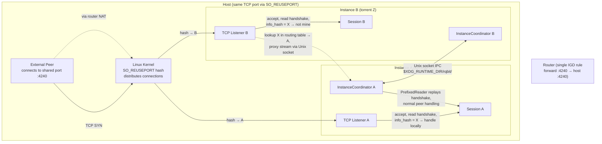
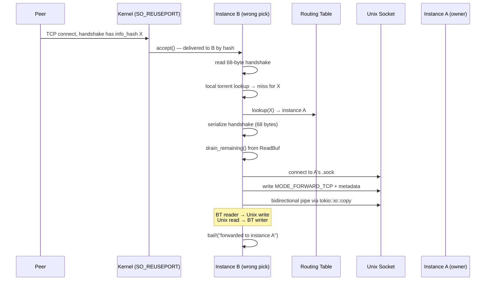
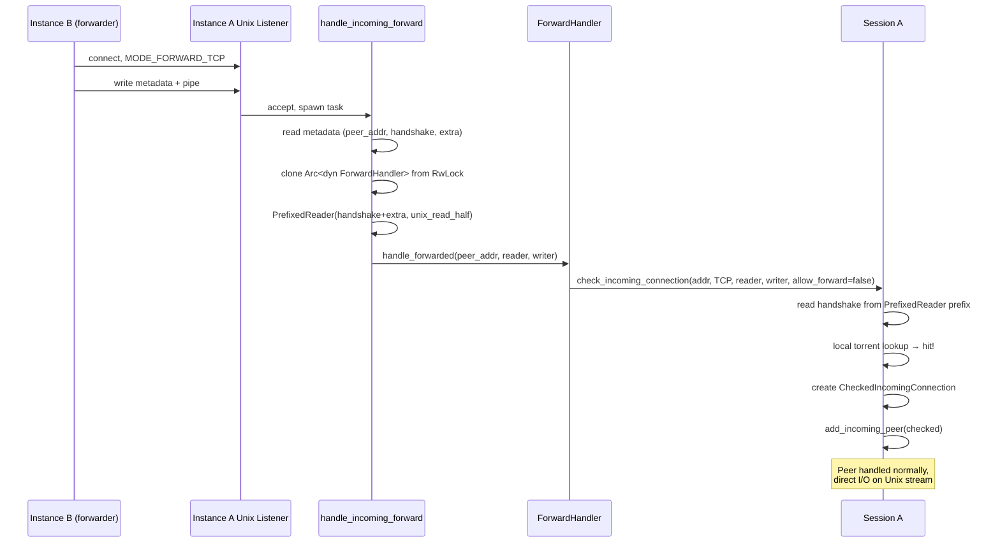
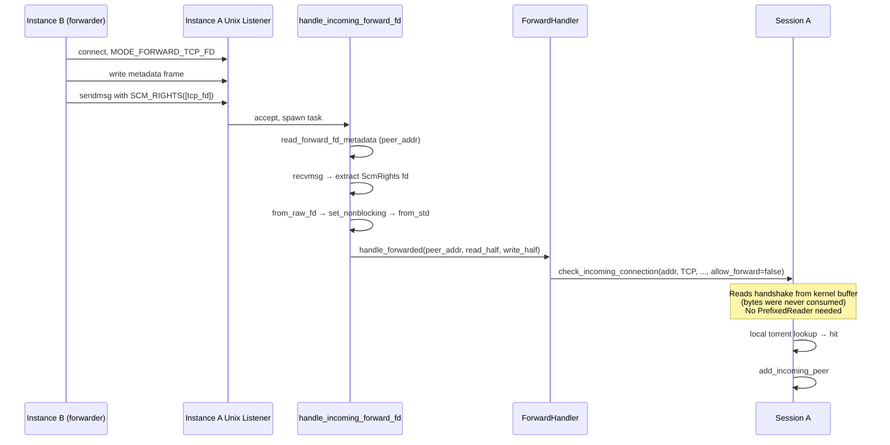

# Multi-Instance SO_REUSEPORT Peer Connection Sharing

## Motivation

Running multiple `rqbit download` processes on the same host, each downloading
different torrents, requires each process to accept incoming peer connections.
Without port sharing, each instance needs a unique listen port, and the router
must forward a separate IGD rule per port. This is fragile and wasteful.

The goal: **multiple instances bind the same TCP port** (via `SO_REUSEPORT`),
share a **single IGD port forwarding rule**, and route incoming peer connections
to the correct instance based on the torrent info_hash in the BT handshake.

The project name `rqbit-re-upnp` reflects this goal: re-thinking UPnP port
forwarding to work across multiple instances.

## Overview



## SO_REUSEPORT Behavior

When multiple sockets bind the same address:port with `SO_REUSEPORT`, the Linux
kernel distributes incoming connections across all sockets using a hash of the
4-tuple `(src_addr, src_port, dst_addr, dst_port)`. Each connection is delivered
to exactly one socket — there is no broadcast, no duplication, and no
application-level steering. The kernel cannot know which instance owns which
torrent.

This means a peer connecting for torrent X (owned by instance A) may have its
connection delivered to instance B. Instance B must forward the connection to
instance A. The **routing key is the info_hash** in the BT handshake (the first
68 bytes the peer sends).

## Architecture

### Module Structure

```
crates/librqbit/src/instances/
├── mod.rs           — module root, InstanceId type, ForwardHandler trait
├── protocol.rs      — binary wire protocol (control + forward messages)
├── routing.rs       — materialized routing table (info_hash → instance set)
└── coordinator.rs   — InstanceCoordinator (lifecycle, discovery, forwarding)
```

The module is `pub` in librqbit and re-exports `InstanceCoordinator`. It
integrates with the session at three points:

1. **Listener** (`check_incoming_connection`): after local torrent lookup fails,
   consult the routing table and forward if another instance owns the torrent.
2. **Session add/delete**: announce/unannounce torrent info_hashes to peers.
3. **Forward handler**: a trait object the session registers so the coordinator
   can hand forwarded connections back to the session for normal peer handling.

### Socket Layout

Each instance creates a single Unix domain socket listener:

```
$XDG_RUNTIME_DIR/rqbit/<instance-id>.sock
```

Where `<instance-id>` is `<pid:08x>-<random:016x>` (e.g.,
`00003039-a1b2c3d4e5f6a7b8`). The PID prevents collisions; the random suffix
prevents PID reuse races.

The socket serves both **control** (persistent) and **forward** (one-shot)
connections, distinguished by a mode byte at the start of each connection.

Stale socket cleanup runs on startup: if `connect()` to a socket file fails
 synchronously, the socket is unlinked.

### InstanceCoordinator

The `InstanceCoordinator` owns:

| Field | Type | Purpose |
|-------|------|---------|
| `instance_id` | `String` | Unique identifier, also the socket filename |
| `socket_path` | `PathBuf` | Own socket path |
| `socket_dir` | `PathBuf` | `$XDG_RUNTIME_DIR/rqbit/` |
| `routing` | `RoutingTable` | Materialized `Id20 → Set<InstanceId>` map |
| `peers` | `RwLock<HashMap<InstanceId, PeerHandle>>` | Connected peer instances |
| `forward_handler` | `RwLock<Option<Arc<dyn ForwardHandler>>>` | Session callback |
| `cancellation` | `CancellationToken` | Shutdown signal |
| `local_torrents` | `RwLock<Vec<[u8; 20]>>` | This instance's info_hashes |

Each `PeerHandle` contains:
- `socket_path: PathBuf` — for opening forward connections
- `sender: mpsc::UnboundedSender<Vec<u8>>` — channel to the peer's writer task

#### Background Tasks

The coordinator spawns several long-lived tasks via `spawn_with_cancel`:

1. **Accept loop** — accepts incoming Unix socket connections, spawns a per-connection task.
2. **Discovery loop** — polls `$XDG_RUNTIME_DIR/rqbit/` every 5 seconds for new/departed `.sock` files.
3. **Per-peer reader** — reads framed control messages from a connected peer's stream.
4. **Per-peer writer** — drains the mpsc channel and writes frames to the peer's stream.

All tasks respect the `CancellationToken` and exit on shutdown.

#### Lifecycle

```
InstanceCoordinator::start()
  → generate instance_id
  → create socket dir
  → cleanup stale sockets
  → bind UnixListener
  → spawn accept loop + discovery loop
  → return Arc<Self>

Session::new_with_opts()
  → if coordinator present: set_forward_handler(SessionForwardHandler)

Session::add_torrent_internal()
  → coordinator.announce_torrent(info_hash)

Session::delete()
  → coordinator.unannounce_torrent(info_hash)

InstanceCoordinator::shutdown()
  → cancel all tasks
  → send Goodbye to all peers
  → unlink socket
```

### IPC Wire Protocol

All communication is over Unix domain stream sockets. The protocol supports
**two encoding formats** selected at compile time via cargo features:

| Feature | Format | Default | Description |
|---------|--------|---------|-------------|
| (none) | Manual binary | Yes | Hand-rolled encode/decode, no msg_type byte overhead from serde |
| `postcard-rpc` | Postcard (serde) | No | Type-safe `#[derive(Serialize, Deserialize)]` message enums, compact varint encoding |

Both formats share the same **typed message definitions** — `ControlMessage`
and `ForwardTcpMeta` enums/structs defined in `protocol.rs`. The encode/decode
functions (`encode_control`, `decode_control`, `encode_forward`,
`decode_forward`) are cfg-gated: postcard uses `postcard::to_allocvec` /
`from_bytes`, while the manual path maps enum variants to tagged binary
payloads.

**Future**: `varlink` (JSON-based, language-agnostic IDL) will become the
default. Auto-detection of postcard vs varlink on incoming connections
(sslh-style first-byte peek) will allow mixed-format interop. See tickets
`rqbit-reuseport-varlink` and `rqbit-reuseport-proto-detect`.

#### Connection Modes

First byte of every connection selects the mode (format-agnostic):

| Mode | Byte | Lifetime | Purpose |
|------|------|----------|---------|
| Control | `0x01` | Persistent | Bidirectional stream of framed control messages |
| Forward TCP | `0x02` | One-shot | Forwarded BT connection: metadata + bidirectional pipe |

#### Framing

All frames use the same length-prefix structure regardless of encoding format:

```
[u32 BE: payload_len] [payload bytes]
```

The payload content depends on the encoding format (see below). Maximum frame
size: 1 MiB.

#### Typed Messages

Format-agnostic types defined in `protocol.rs`:

```rust
enum ControlMessage {
    Hello { instance_id: String },
    TorrentsAdded { info_hashes: Vec<[u8; 20]> },
    TorrentsRemoved { info_hashes: Vec<[u8; 20]> },
    WhoHas { info_hash: [u8; 20] },
    IHas { info_hash: [u8; 20] },
    Goodbye,
}

struct ForwardTcpMeta {
    peer_addr: SocketAddr,
    handshake: Vec<u8>,
    extra: Vec<u8>,
}
```

#### Manual Binary Format (default)

Control message payload: `[u8: msg_type] [manual_payload]`

| msg_type | Value | Payload |
|----------|-------|---------|
| Hello | `0x01` | `[u16 BE: id_len][id UTF-8]` |
| TorrentsAdded | `0x02` | `[u16 BE: count][count × 20 bytes]` |
| TorrentsRemoved | `0x03` | `[u16 BE: count][count × 20 bytes]` |
| WhoHas | `0x04` | `[20 bytes]` |
| IHas | `0x05` | `[20 bytes]` |
| Goodbye | `0x06` | (empty) |

Forward metadata payload: `[u32 BE: addr_len][addr][u32 BE: hs_len][hs][u32 BE: extra_len][extra]`

SocketAddr manual encoding:
- IPv4: `[1 byte: family=4][4 bytes: octets][2 bytes BE: port]`
- IPv6: `[1 byte: family=6][16 bytes: octets][2 bytes BE: port][4 bytes BE: flowinfo][4 bytes BE: scope_id]`

#### Postcard Format (`--features postcard-rpc`)

Control message payload: `postcard::to_allocvec(&ControlMessage)`

Postcard serializes the enum variant tag as a varint, followed by the variant
fields. `[u8; 20]` serializes as 20 raw bytes. `String` as varint length + UTF-8.
`Vec<[u8; 20]>` as varint count + concatenated 20-byte arrays. `SocketAddr`
serializes natively via serde (no manual family byte needed).

Forward metadata payload: `postcard::to_allocvec(&ForwardTcpMeta)`

All within the same `[u32 BE: payload_len][payload]` frame. The mode byte and
bidirectional pipe structure are identical to the manual format.

#### Hello Exchange

When two instances connect (either direction), both send Hello as the first
control frame, followed by their current torrent list (as TorrentsAdded).
This bootstraps the routing table.

### Routing Table

```rust
struct RoutingTable {
    info_hash_to_instances: RwLock<HashMap<[u8; 20], HashSet<InstanceId>>>,
}
```

**Materialized**: maintained proactively via control messages, not queried on
demand. When `announce_torrent` is called, the entry is added to both the local
table and broadcast to all peers. When a peer announces, the local table is
updated in the reader task.

**Multi-instance ownership**: a torrent can be owned by multiple instances (e.g.,
same torrent added to two instances). `lookup()` returns the first available
owner; load balancing is a future optimization.

**Consistency window**: there's a brief period after `announce_torrent` before
peers receive the `TorrentsAdded` message. During this window, a peer's routing
table miss causes the connection to be dropped. The `who_has()` method provides
a fallback broadcast query, though it's not yet wired into the forwarding path.

### Forwarding: Stream Proxy

The current implementation uses a **stream proxy** approach rather than fd
passing (SCM_RIGHTS). This was chosen because it works with the existing
`BoxAsyncReadVectored` / `BoxAsyncWrite` trait objects without needing raw fd
access from the accept loop.

#### Forwarding Flow (Sender Side)

In `check_incoming_connection` (`session.rs`), after the local torrent lookup
fails:



The `bail!` is intentional — it signals to the `task_listener` loop that this
connection was forwarded and should not be processed further. The error is
logged at debug level.

#### Forwarding Flow (Receiver Side)

The receiving instance's accept loop spawns a task for each incoming Unix
connection. For forward connections:



#### PrefixedReader

The key mechanism that makes stream proxy work. When `check_incoming_connection`
reads the handshake via `ReadBuf::read_handshake()`, it calls `reader.read(buf)`.
The `PrefixedReader` intercepts this:

1. If prefix bytes remain: copies them into the read buffer, returns immediately.
2. If prefix exhausted: delegates to the underlying Unix stream read.

Once the prefix is consumed, all subsequent reads go directly to the Unix
socket. The BT protocol handler is unaware that the handshake was pre-read —
it sees a normal stream.

The `PrefixedReader` is wrapped in `AsyncReadToVectoredCompat` (from
`vectored_traits.rs`) to satisfy the `AsyncReadVectored` trait that
`ReadBuf::read_handshake` requires.

#### allow_forward Guard

Forwarded connections are handled with `allow_forward = false` in
`check_incoming_connection`. This prevents recursive forwarding: if instance A
receives a forwarded connection but no longer has the torrent (race condition:
torrent was deleted between the forwarder's lookup and arrival), it drops the
connection instead of trying to forward it again. This breaks what would
otherwise be an infinite forwarding loop.

### ForwardHandler Trait

```rust
#[async_trait::async_trait]
pub trait ForwardHandler: Send + Sync + 'static {
    async fn handle_forwarded(
        &self,
        peer_addr: std::net::SocketAddr,
        reader: BoxAsyncReadVectored,
        writer: BoxAsyncWrite,
    );
}
```

Implemented by `SessionForwardHandler` in `session.rs`, which holds a
`Weak<Session>`. The weak reference prevents the coordinator from keeping the
session alive after shutdown.

The handler clones the `Arc<dyn ForwardHandler>` out of the `RwLock` read guard
before awaiting, so no lock is held during connection handling. This allows
concurrent forwarded connections from multiple sources without contention.

### Concurrency Model

Multiple forwarded connections arriving simultaneously are handled correctly:

- Each Unix socket connection is accepted independently in the accept loop,
  spawned as its own task.
- Each task reads metadata, clones the `ForwardHandler` Arc, and processes
  independently.
- The session's torrent database uses `RwLock`; the read guard is dropped
  before any `.await` to keep the future `Send`.
- The torrent's peer table uses `DashMap`; concurrent `add_incoming_peer` calls
  are the normal case.
- The `peer_limit` applies equally to direct and forwarded connections.

### Discovery

Currently poll-based: every 5 seconds, `discover_peers()` reads the socket
directory, compares found `.sock` files against the connected peer set, and
connects to new instances / removes departed ones.

**Future (ticket `rqbit-reuseport-discovery`)**: `inotify` watcher on the
socket directory for `IN_CREATE` / `IN_DELETE` events, providing instant
discovery instead of 5-second latency.

## Integration Points

### ListenerOptions

`reuseport: bool` field added to `ListenerOptions` (default: `false`). When
`true`, sets `BindOpts.reuseport = true` for the TCP listener bind, which
calls `set_reuse_port(true)` on the socket via `socket2`.

Currently only wired on the `download` subcommand. Server/share/desktop
support tracked in `rqbit-reuseport-broader`.

### SessionOptions

`instance_coordinator: Option<Arc<InstanceCoordinator>>` field added to
`SessionOptions` (default: `None`). When `Some`, the session:

1. Stores the coordinator reference
2. Registers a `SessionForwardHandler` as the forward handler
3. Announces torrents on add, unannounces on delete

### check_incoming_connection

Signature changed to accept `allow_forward: bool`:
- Direct connections from the TCP listener pass `true`
- Forwarded connections (from `SessionForwardHandler`) pass `false`

On local torrent miss with `allow_forward = true`:
1. Look up `info_hash` in coordinator's routing table
2. If found: serialize handshake, drain ReadBuf, call `forward_tcp_stream()`
3. Bail with "forwarded to instance {id}" (logged at debug)

### ReadBuf

`drain_remaining()` method added — extracts any bytes remaining in the ringbuffer
after the handshake was consumed. These are the bytes the peer sent alongside the
handshake (e.g., bitfield message in the same TCP segment). They're sent as the
`extra` field in the forward metadata and replayed by `PrefixedReader`.

## Limitations and Future Work

### Stream Proxy vs FD Passing (ticket: rqbit-reuseport-fd-handoff)

The current implementation supports **both** forwarding mechanisms side-by-side:

| Mode byte | Path | Status |
|-----------|------|--------|
| `0x02` MODE_FORWARD_TCP | Stream proxy via bidirectional `tokio::io::copy` through the forwarder's Unix socket | Original implementation; always available |
| `0x03` MODE_FORWARD_TCP_FD | SCM_RIGHTS fd passing; raw TCP fd handed to owning instance, forwarder bows out | Implemented for TCP only; uTP falls back to stream proxy |

The receiver always dispatches on the mode byte, so any instance accepts both
modes regardless of its own preference. The sender picks via
`InstanceCoordinator::forward_mode()` (runtime, default `FdPass`); the choice
only affects outgoing forwards.

#### FD Passing Flow (Sender Side)

When `forward_mode == FdPass` and the TCP accept loop peeks a BT handshake
whose info_hash routes to a peer instance, the sender hands the raw TCP fd to
the owning instance via SCM_RIGHTS ancillary data:

```mermaid
sequenceDiagram
    participant P as Peer
    participant K as Kernel (SO_REUSEPORT)
    participant B as Instance B (TCP listener)
    participant R as Routing Table
    participant U as Unix Socket
    participant A as Instance A (owner)

    P->>K: TCP connect, handshake has info_hash X
    K->>B: accept() — delivered to B by hash
    B->>B: peek (MSG_PEEK) 68-byte handshake
    B->>R: lookup(X) → instance A
    B->>U: connect to A's .sock
    B->>U: write MODE_FORWARD_TCP_FD + ForwardTcpFdMeta
    B->>U: sendmsg with SCM_RIGHTS([tcp_fd])
    Note over B: Bytes still in kernel buffer;<br/>B never consumed them
    B->>B: drop TcpStream (closes our fd ref)
    Note over A: Kernel has dup'd the fd into A's table
```

The TCP stream is **never split or boxed** on the sender side. The
`task_listener_tcp` accept loop (session.rs) calls `peek_bt_handshake()` to
read the BT handshake via `MSG_PEEK` (non-consuming), looks up the route, and
either:

1. **ForwardFd route:** `coord.forward_tcp_fd(&instance_id, addr, &stream)`.
   On success, drops the stream (the receiver has its own fd). On failure,
   falls through to the Default route.
2. **Default route:** splits into `OwnedReadHalf`/`OwnedWriteHalf`, boxes,
   feeds into `check_incoming_connection(allow_forward=true)` — same as the
   pre-fd-pass code path. This handles local torrents, stream-proxy fallback,
   and uTP.

#### FD Passing Flow (Receiver Side)

`handle_incoming_forward_fd` (coordinator.rs) reads the metadata frame via
async `read_exact`, then `recvmsg` with a cmsg buffer sized via
`nix::cmsg_space!(RawFd)` to collect the SCM_RIGHTS payload:



The receiver wraps the raw fd via
`unsafe { TcpStream::from_raw_fd(fd) }` + `set_nonblocking(true)` +
`tokio::net::TcpStream::from_std()`. The `unsafe` block is isolated to one
helper call site; it is sound because the kernel created the fd during
SCM_RIGHTS and we are its sole owner.

#### Why no PrefixedReader for fd-pass

`PrefixedReader` exists in the stream-proxy path because `check_incoming_connection`
eagerly reads the handshake via `ReadBuf::read_handshake`, consuming it from the
wire. When forwarding, those bytes have to be replayed.

In the fd-pass path, the sender peeks (not consumes) the handshake to make the
routing decision. The bytes stay in the kernel buffer. When the receiver wraps
the fd as a TcpStream and hands it to `check_incoming_connection`, the
`read_handshake` call reads the bytes fresh from the wire. No replay needed.

#### Why no OwnedWriteHalf Drop hazard

`tokio::net::tcp::OwnedWriteHalf::Drop` calls `shutdown(Write)`, which would
send a half-close EOF to the peer — breaking the connection immediately after
handoff. The fd-pass path sidesteps this: the sender never calls `into_split()`
on the stream. It holds the original `TcpStream`, whose `Drop` only closes the
fd (no shutdown). After sendmsg, the kernel has dup'd the fd into the
receiver's process; our local close releases our reference without affecting
the receiver's fd or the peer's TCP state.

#### tokio / nix integration

Both `sendmsg` (sender) and `recvmsg` (receiver) use nix 0.30
(`features = ["uio", "socket"]`, already in `Cargo.toml`). The integration
pattern avoids `spawn_blocking`:

```text
loop {
    stream.writable().await?;            // tokio readiness, reuses reactor registration
    match nix_sendmsg(stream.as_raw_fd(), iov, cmsgs, ...) {
        Ok(_) => break,
        Err(EAGAIN) => continue,         // race with another writer; retry
        Err(e) => return Err(e),
    }
}
```

Same shape for `recvmsg` with `stream.readable().await`. No `AsyncFd`
double-registration, no thread-pool trip.

#### Control API

`InstanceCoordinator` exposes:

```rust
pub fn forward_mode(&self) -> ForwardMode;
pub fn set_forward_mode(&self, mode: ForwardMode);
```

`ForwardMode::default()` is `FdPass`. To force stream-proxy everywhere:

```rust
coord.set_forward_mode(ForwardMode::StreamProxy);
```

The receiver always accepts both mode bytes regardless of this setting.

#### Drop-down Summary

| Aspect | Stream Proxy (`0x02`) | FD Pass (`0x03`) |
|---|---|---|
| Bytes path | peer → forwarder → Unix socket → owner | peer → owner (direct) |
| Tasks per forward | 2 (copy futures) | 0 |
| Fd overhead per forward | 1 Unix socket pair | 1 duplicated fd in receiver |
| Forwarder lifetime bound to connection | Yes | No |
| Works with uTP | Yes | No (falls back to stream proxy) |
| Requires `unsafe` | No | Yes, isolated to `from_raw_fd` on receiver |
| Receiver complexity | PrefixedReader replay | None (bytes still in kernel buffer) |

### Stream Proxy (alternate path)

### uTP (ticket: rqbit-reuseport-utp)

Blocked by `librqbit-utp` v0.7.0 hardcoding `reuseport: false` internally. Even
with the flag, incoming uTP datagrams are distributed across instances by the
kernel — a datagram for instance A's uTP connection may arrive at instance B.
Two approaches documented:

1. **Raw datagram forwarding**: hook into `librqbit-utp` to intercept datagrams
   before the uTP stack, forward via IPC with original source address preserved.
2. **Dedicated socket + fd handoff**: per-connection UDP socket with uTP state
   migration via SCM_RIGHTS.

When `--reuseport` is active, uTP listen is silently disabled (TCP is the
default mode).

### IGD Advertisement Sharing (ticket: rqbit-reuseport-igd)

The original motivation. When multiple instances share the same port:
1. First instance's `AddPortMapping` succeeds; subsequent instances get HTTP 718
   `ConflictInMappingEntry` — treat as success.
2. All instances independently renew leases at `lease_duration / 2`.
3. On shutdown: skip `DeletePortMapping` if peer instances are still alive
   (check via IPC).

### inotify Discovery (ticket: rqbit-reuseport-discovery)

Replace the 5-second polling interval with `inotify` on the socket directory
for real-time `IN_CREATE` / `IN_DELETE` events. Behind `cfg(target_os = "linux")`.

### Buffer/Crash Strictness Modes

Optional modes for connections that can't be routed after all retries:
- **Buffer mode**: queue undeliverable connections for background retry
- **Crash mode**: panic on undeliverable connections (debug/CI)
- Default: silent drop

### Load Balancing

When multiple instances own the same torrent, `lookup()` returns the first.
Future: round-robin or least-connections selection.

### DHT Reuseport

DHT currently hardcodes `reuseport: false` (ephemeral port by default). Not in
scope for multi-instance port sharing — each instance can have its own DHT port.

## File Manifest

| File | Role |
|------|------|
| `crates/librqbit/src/instances/mod.rs` | Module root, `InstanceId`, `ForwardHandler` trait |
| `crates/librqbit/src/instances/coordinator.rs` | `InstanceCoordinator`, discovery, accept/forward loops, `PrefixedReader` |
| `crates/librqbit/src/instances/protocol.rs` | Wire protocol encode/decode |
| `crates/librqbit/src/instances/routing.rs` | `RoutingTable` |
| `crates/librqbit/src/lib.rs` | `pub mod instances;` |
| `crates/librqbit/src/listen.rs` | `reuseport: bool` on `ListenerOptions`, threaded to `BindOpts` |
| `crates/librqbit/src/session.rs` | Coordinator field, forward routing, announce hooks, `SessionForwardHandler` |
| `crates/librqbit/src/read_buf.rs` | `drain_remaining()` |
| `crates/librqbit/src/vectored_traits.rs` | `AsyncReadVectoredIntoCompat` (existing, used by PrefixedReader) |
| `crates/rqbit/src/main.rs` | `--reuseport` flag on `DownloadOpts`, coordinator creation |
| `crates/librqbit/Cargo.toml` | `nix` with `socket` feature |

## Usage

```bash
# Terminal 1: instance A downloading torrent X
rqbit download --reuseport --listen-port 4240 \
    magnet:?xt=urn:btih:AAAA... /downloads

# Terminal 2: instance B downloading torrent Z
rqbit download --reuseport --listen-port 4240 \
    magnet:?xt=urn:btih:BBBB... /downloads

# Both bind 0.0.0.0:4240 via SO_REUSEPORT
# Incoming peers for torrent X may arrive at either instance
# Instance B forwards to Instance A via Unix socket IPC
# Router has one IGD rule for port 4240
```

Environment variable: `RQBIT_REUSEPORT=1`

## Key Design Decisions

1. **Stream proxy over fd passing**: works with existing trait objects, simpler,
   no unsafe. Acceptable overhead (localhost pipe). FD passing is a future
   optimization.
2. **One socket per instance** (not two): mode byte distinguishes control vs
   forward connections. Simpler discovery (one `.sock` file per instance).
3. **Materialized routing table**: proactive announcements, not on-demand
   queries. Minimizes latency for the common case (connection arrives, table
   already has the answer). `WhoHas` broadcast is a fallback for races.
4. **`allow_forward = false` for forwarded connections**: simple, effective loop
   prevention. No TTL counters or hop limits needed.
5. **`async_trait` for `ForwardHandler`**: needed for `dyn ForwardHandler` trait
   object. The project already depends on `async_trait`.
6. **Polling discovery over inotify**: simpler, cross-platform, acceptable 5s
   latency. inotify is a straightforward enhancement.
7. **XDG_RUNTIME_DIR**: standard location for per-user runtime files. Files are
   automatically cleaned up on logout. Fallback to `/tmp` if unset.
